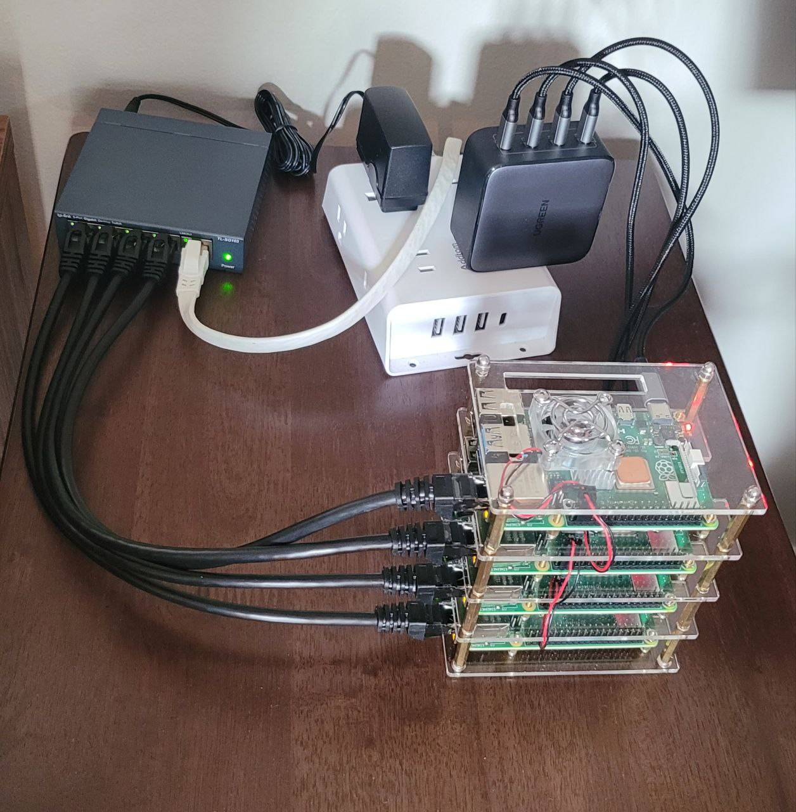

# Raspberry Pi Kubernetes Provisioning Guide

This repository documents a reproducible approach to provisioning Raspberry Pi nodes and assembling a functional Kubernetes cluster using `kubeadm`.

It is intended as a practical reference for building, operating, and understanding Kubernetes on bare metal — from the operating system and network layer up through cluster initialization.

---

## Cluster Overview



Physical Raspberry Pi Kubernetes cluster used throughout this repository.

---

## Project Goals

- Provision Raspberry Pi devices using a clean, minimal Linux installation
- Configure system prerequisites required for Kubernetes
- Install and configure a container runtime
- Initialize a Kubernetes control plane
- Join and manage worker nodes
- Document operational decisions, pitfalls, and lessons learned

This repository prioritizes **clarity, repeatability, and understanding** over automation shortcuts.

---

## Why This Repository Exists

For much of my career, I built and operated systems inside startups and organizations where the work lived in production environments rather than public repositories.

This project marks the beginning of a deliberate effort to **document infrastructure patterns, operational workflows, and Linux-first system design in public**, both for personal reference and for others building similar systems.

The goal is not novelty, but **durable, understandable infrastructure**.

---

## Environment

- **Hardware:** 4× Raspberry Pi 4 Model B (ARM64)  
  Additional components include network cabling, shared power, storage media, and a small Ethernet switch.

- **Operating System:** Ubuntu 22.04 LTS

- **Container Runtime:** containerd

- **Kubernetes:** kubeadm-based cluster

- **Networking:** Local LAN (static addressing)

Detailed hardware inventory and version-specific configuration notes are documented in the `docs/` directory.

---

## Documentation (Canonical)

Canonical documentation for this cluster lives in **kai-memory-palace**:

- 📄 **[Pi Cluster Hardware](https://github.com/ro6ertkenny/kai-memory-palace/blob/main/k8s/ops%2Bprovisioning/rpi-cluster/pi-cluster-hardware.md)** — Physical cluster components, power, cooling, networking, and headless build details

- ⚙️ **[Pi Cluster Environment](https://github.com/ro6ertkenny/kai-memory-palace/blob/main/k8s/ops%2Bprovisioning/rpi-cluster/pi-cluster-environment.md)** — OS, kernel, container runtime, Kubernetes versions, static networking, DNS, and kubeconfig setup

- 🧾 **[Pi Cluster Snapshot](https://github.com/ro6ertkenny/kai-memory-palace/blob/main/k8s/ops%2Bprovisioning/rpi-cluster/pi-cluster-snapshot.md)** — Node inventory, roles, IPs, and current cluster state reference

---

## Repository Structure

```text
.
├── README.md
├── docs/
│   ├── control-plane.md
│   ├── worker-nodes.md
│   └── networking.md
├── scripts/
│   └── bootstrap.sh
└── .gitignore

```

Documentation and scripts evolve as the cluster matures.

## Background and Attribution

This project was inspired in part by *Kubernetes: Up & Running* by Kelsey Hightower, Brendan Burns, and Joe Beda
(O’Reilly Media), specifically Appendix A, “Building Your Own Kubernetes Cluster”.

The implementation here reflects my own environment, including updated operating system versions,
Kubernetes releases, hardware constraints, and operational decisions made through hands-on
experimentation.

All documentation and scripts in this repository are written from direct experience and adapted
to the system described above.

## Status

🚧 Active and evolving

This repository is intentionally built incrementally, with an emphasis on understanding each
layer of the system before introducing additional automation or abstraction.

## Author

Robert Kenny
Linux • Kubernetes • Infrastructure
robert@headhigh.com

Maintained with Kai 🤙
